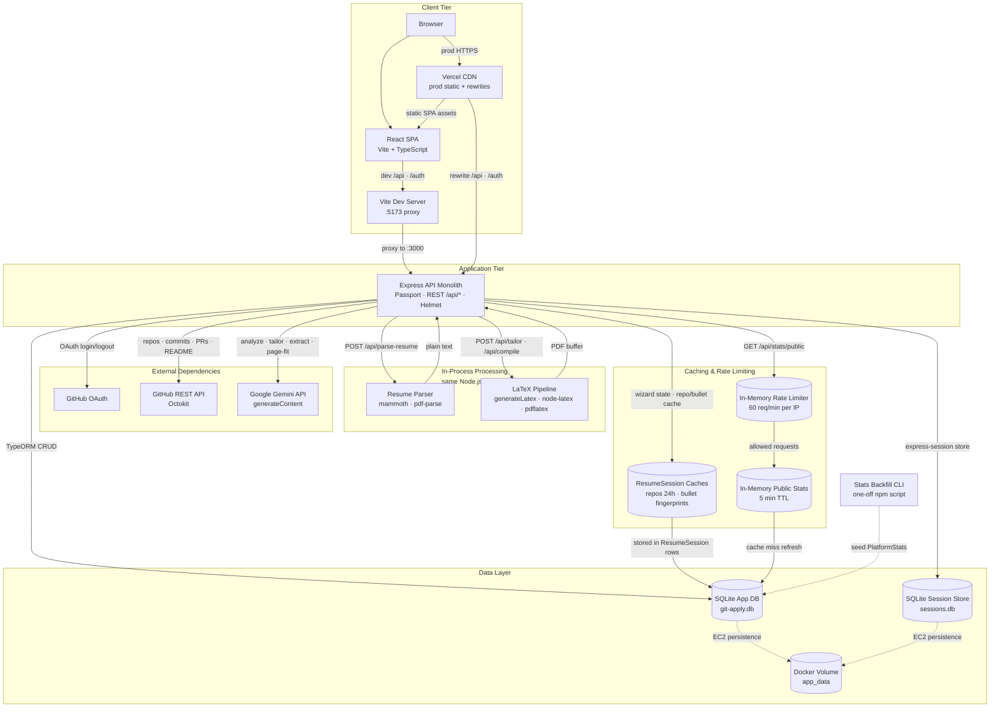

# GitApply

Turn your GitHub activity into an ATS-optimized resume. Connect GitHub, select repositories, generate AI-powered bullet points, tailor to a job description, and export a Jake LaTeX PDF.

**Deploy:** [DEPLOY.md](./DEPLOY.md) — Vercel frontend + EC2 backend (free tier, no domain).

## Architecture



See [ARCHITECTURE_EXPLANATION.md](./ARCHITECTURE_EXPLANATION.md) for a layer-by-layer walkthrough.

## Stack

- **Frontend:** React, Vite, TypeScript, Tailwind CSS (GitHub-dark UI, Bricolage Grotesque + Plus Jakarta Sans)
- **Backend:** Node.js, Express, TypeORM, SQLite
- **Auth:** GitHub OAuth (Passport)
- **AI:** Google Gemini
- **Export:** LaTeX → PDF (`moderncv` + `pdflatex`)

## Prerequisites

- Node.js 20 (`nvm use` — see `.nvmrc`)
- GitHub OAuth app ([create one](https://github.com/settings/developers))
- Gemini API key ([Google AI Studio](https://aistudio.google.com/apikey))

For PDF export outside Docker:

```bash
sudo apt install -y texlive-latex-base texlive-latex-recommended texlive-latex-extra texlive-fonts-recommended
```

## Setup

```bash
cp .env.example .env
# Fill in GITHUB_CLIENT_ID, GITHUB_CLIENT_SECRET, GEMINI_API_KEY,
# SESSION_SECRET, and ENCRYPTION_KEY (openssl rand -hex 32)

npm install
npm install --prefix client
npm run dev
```

- **App:** http://localhost:5173
- **API:** http://localhost:3000

Set your GitHub OAuth callback URL to `http://localhost:5173/auth/github/callback`.

## Docker

```bash
cp .env.docker.example .env   # or use your existing .env
npm run docker:dev            # dev — ports 5173 + 3000, includes TeX Live
npm run docker:prod           # production profile — port 4000
```

The Docker image includes `pdflatex` and the Jake resume TeX packages — no local LaTeX install needed.

**Production compose (EC2):**

```bash
docker compose -f docker-compose.prod.yml up -d --build
curl http://localhost:4000/api/health
curl http://localhost:4000/api/stats/public
```

**Seed landing page stats** from existing saved resume versions (optional, safe to re-run):

```bash
npm run build
npm run backfill:stats
# inside prod container:
docker compose -f docker-compose.prod.yml exec app node dist/cli/backfillPlatformStats.js
```

The landing page at `/` loads live metrics from `GET /api/stats/public` (resumes generated, ATS pass rate, avg time to resume). New stats accumulate automatically on each successful `POST /api/tailor`.

## App flow

1. **Connect** — Sign in with GitHub on the landing page
2. **Analyze** — Select repos, generate resume bullets with Gemini
3. **Bullets** — Review and edit generated bullets
4. **Enrich** — Upload existing resume (contact extracted automatically), add notes
5. **Tailor** — Paste a job description, generate tailored resume
6. **Export** — Edit LaTeX, compile PDF, download

All steps run on a single page at `/app`.

## Scripts

| Command | Description |
|---|---|
| `npm run dev` | Start Express + Vite dev servers |
| `npm run build` | Build client and server for production |
| `npm start` | Run production server |
| `npm run backfill:stats` | Seed landing stats from saved resume versions (requires `npm run build` first) |
| `npm run backfill:stats:dev` | Same as above via ts-node (local dev) |
| `npm run docker:dev` | Dev via Docker Compose |
| `npm run docker:prod` | Production via Docker Compose (`--profile prod`, port 4000) |

## Environment variables

See `.env.example` for all required variables.

## License

Private — all rights reserved.
